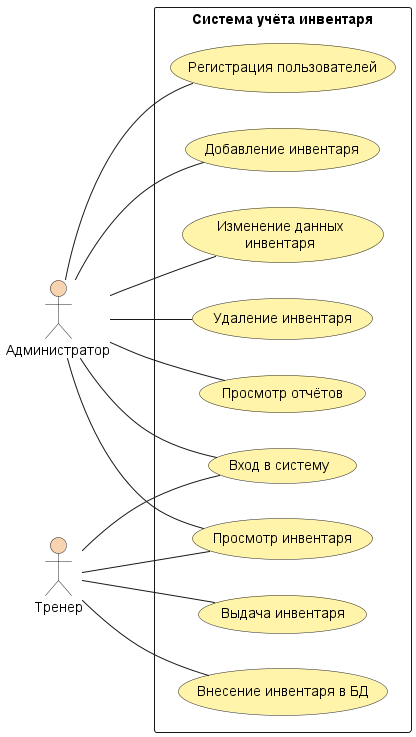

# Учёт спортивного инвентаря в зале

Учебный проект по дисциплине «Информационные системы». Лабораторные работы №1 и №2.

**Автор:** Смирнов Степан, группа 26ИВТ-2-1

## Описание проекта

Система предназначена для хранения информации о спортивном оборудовании и контроля его **наличия** и **состояния**. Она заменяет учёт в разных журналах и документах единой базой данных.

Для каждого вида инвентаря хранятся:

- название и категория;
- *количество* (в зале может быть несколько одинаковых предметов);
- место хранения;
- состояние и дата поступления;
- инвентарный номер и примечание.

## Пользователи системы

| № | Пользователь  | Роль в системе                                                                                                              |
|---|---------------|-----------------------------------------------------------------------------------------------------------------------------|
| 1 | Администратор | Входит в систему, регистрирует пользователей, добавляет, просматривает, изменяет и удаляет инвентарь, просматривает отчёты |
| 2 | Тренер        | Входит в систему, просматривает инвентарь, вносит инвентарь в базу данных и оформляет выдачу                                |

## Основные функции

1. Вход в систему (авторизация пользователей).
2. Регистрация пользователей системы.
3. Добавление нового инвентаря с указанием количества.
4. Просмотр инвентаря, его количества и состояния.
5. Изменение данных об инвентаре.
6. Удаление инвентаря.
7. Внесение инвентаря в базу данных.
8. Выдача инвентаря с проверкой количества и состояния.
9. Просмотр отчётов.